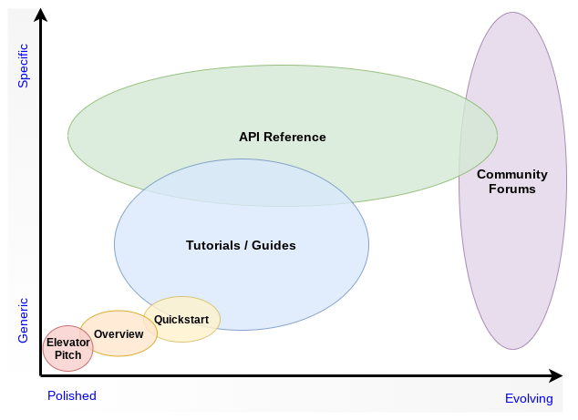

*TheGoodDocsProject* provides best practice templates and writing instructions that empowers people to document Open Source Software, which incidentally will be directly applicable to other domains too.
 
### Doc Types

Multiple doc types are required to achieve a project’s Minimum Viable Docset. Each serves a different purpose and has differing requirements.

For each doc type we expect to build:

*   A template, embedded with concise writing instructions.
*   Example(s).
*   Deeper practical tips and explanations and justification for approaches. 
*   Collated background theory.

We are focusing on content, not doc formats or tool chains, at least not yet.

### Governance

To address quality and capture collaborative wisdom:

*   We will apply a write/review/refine/reiterate process,
*   With just-enough-governance,
*   Overseen by a Project Steering Committee.

### Quality

Document quality requirements differs between doc types and project maturity. We plan to describe doc and process characteristics and processes which lead to maturity, to facilitate discussion around quality.

